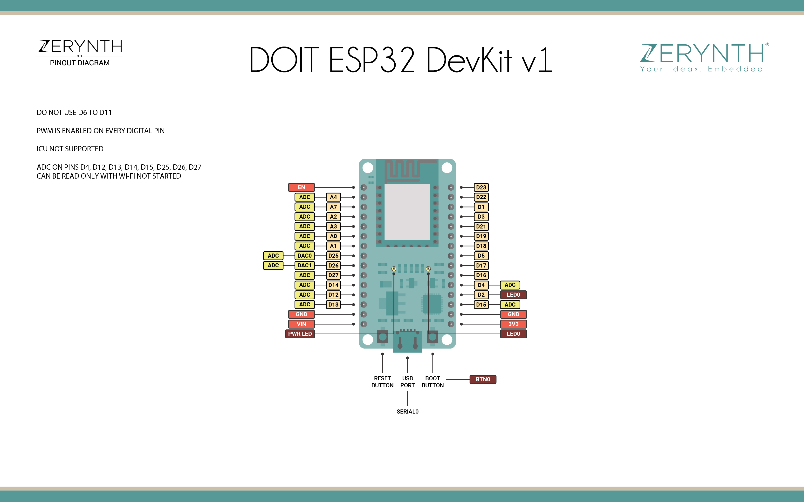

# esp32 devkit

bought from [banggood](https://www.banggood.com/ESP32-Development-Board-WiFiBluetooth-Ultra-Low-Power-Consumption-Dual-Cores-ESP-32-ESP-32S-Board-p-1109512.html)

or from 
https://fr.aliexpress.com/item/Official-DOIT-ESP32-Development-Board-WiFi-Bluetooth-Ultra-Low-Power-Consumption-Dual-Core-ESP-32-ESP/32776342162.html

orfrom 
https://fr.aliexpress.com/item/ESP-32-ESP-32S-D-veloppement-Conseil-WiFi-Bluetooth-Ultra-Faible-consommation-lectricit-Double-Noyaux-ESP32/32965963703.html?spm=a2g0s.9042311.0.0.40696c37xr5YFu

## description 

Introduction:
 
ESP32 is already integrated antenna and RF balun, power amplifier, low-noise amplifiers, filters, 
and power management module. The entire solution takes up the least amount of printed circuit board area.
This board is used with 2.4 GHz dual-mode Wi-Fi and Bluetooth chips by TSMC 40nm low power technology,
power and RF properties best, which is safe, reliable, and scalable to a variety of applications.
 
Features:
 
High performance-price ratio
Small volume, easily embeded to other products
Strong function with support LWIP protocol, Freertos
Supporting three modes: AP, STA, and AP+STA
Supporting Lua program, easily to develop
Development Board: https://github.com/Nicholas3388/LuaNode 

### layout information

see https://docs.zerynth.com/latest/official/board.zerynth.doit_esp32/docs/index.html

 
